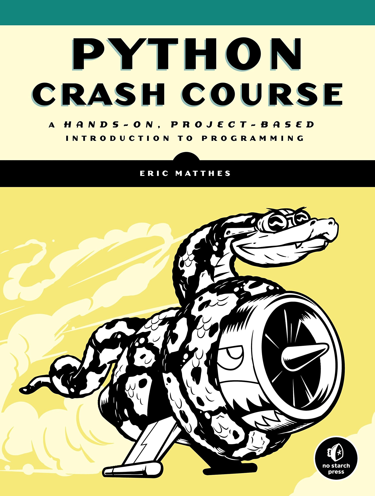

# Python-Crash-Course-Solutions

<h3>Python Crash Course - Eric Matthes is a fabulous book for beginners who are willing to learn python programming language. Thi book focuses more on the Hands On learning by providing exercises after each chapter.  </h3>
<h4>Here, in this repository I have posted my solutions till chaper 12. Feel free to checkout and try it yourself.</h4>

<h5>Chapter 1 is not included because it's all about installations and stuffs.</h5>

